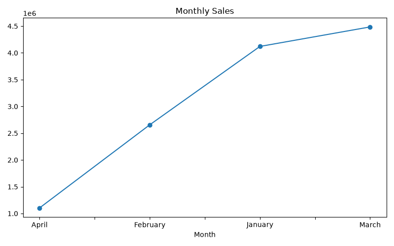
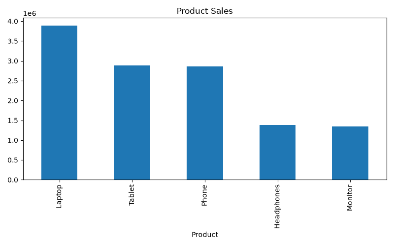
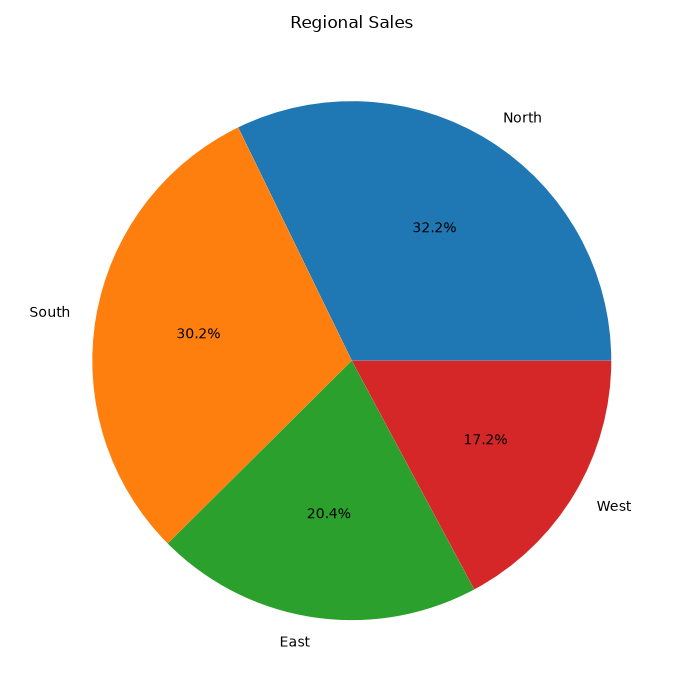
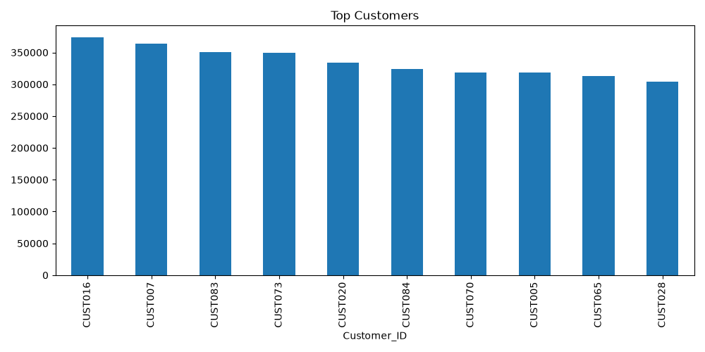

# 📊 Advanced Data Manipulation with Pandas

## 📌 Project Overview

This project demonstrates advanced data analysis techniques using **Python**, **Pandas**, and **Matplotlib**. The project analyzes sales and customer datasets to uncover valuable business insights through data cleaning, exploration, grouping, filtering, pivot tables, and visualizations.

The goal is to transform raw data into meaningful information that helps understand customer behavior, product performance, sales trends, and regional business performance.

---

# 🎯 Objectives

- Load and explore datasets
- Clean and prepare data
- Handle missing values
- Convert date columns
- Group and aggregate data
- Filter data using multiple conditions
- Perform customer analysis
- Analyze monthly sales trends
- Create pivot tables
- Generate professional visualizations
- Produce business insights and recommendations

---

# 🛠️ Technologies Used

- Python 3
- Pandas
- Matplotlib

---

# 📂 Project Structure

```
Advanced Data Manipulation with Pandas/
│
├── data/
│   ├── sales_data.csv
│   └── customer_churn.csv
│
├── visualizations/
│   ├── monthly_sales.png
│   ├── product_sales.png
│   ├── regional_sales.png
│   ├── top_customers.png
│   └── customer_distribution.png
│
├── report/
│   └── business_report.md
│
├── main.py
├── requirements.txt
└── README.md
```

---

# 📊 Dataset Information

## Sales Dataset

The sales dataset contains information about:

- Date
- Product
- Quantity
- Price
- Customer ID
- Region
- Total Sales

## Customer Churn Dataset

The customer dataset contains customer-related information used for basic customer exploration.

---

# 📈 Features

✅ Data Loading

✅ Data Cleaning

✅ Missing Value Handling

✅ Duplicate Removal

✅ Date Conversion

✅ Customer Analysis

✅ Product Performance Analysis

✅ Regional Sales Analysis

✅ Monthly Sales Trend Analysis

✅ Pivot Table Creation

✅ Business Report Generation

✅ Data Visualization

---

# 📊 Analysis Performed

## Customer Analysis

- Identified top customers
- Calculated customer purchase values
- Compared customer contributions

## Product Analysis

- Best-selling products
- Product revenue comparison

## Regional Analysis

- Highest revenue regions
- Region-wise sales distribution

## Monthly Sales Analysis

- Monthly revenue
- Seasonal trends

## Advanced Analysis

- GroupBy operations
- Filtering with multiple conditions
- Pivot Tables
- DateTime operations

---

# 📉 Visualizations

The project automatically generates the following charts:

- 📈 Monthly Sales Trend
- 📊 Product-wise Sales
- 🥧 Regional Sales Distribution
- 📊 Top Customers
- 📊 Customer Distribution

All charts are saved inside the **visualizations** folder.

---

# 🚀 Installation

Clone the repository:

```bash
git clone https://github.com/LokeshRawat77/Advanced-Data-Manipulation-with-Pandas.git
```

Install required libraries:

```bash
pip install -r requirements.txt
```

---

# ▶️ Run the Project

```bash
python main.py
```

---

# 📄 Output

After execution, the project generates:

- Business Report
- Monthly Sales Chart
- Product Sales Chart
- Regional Sales Chart
- Top Customers Chart
- Customer Distribution Chart

---

# 💡 Business Insights

- Identified the most valuable customers.
- Determined the highest-performing products.
- Compared sales across different regions.
- Analyzed monthly sales trends.
- Generated summarized reports using pivot tables.

---

# 📸 Screenshots

### Monthly Sales



### Product Sales



### Regional Sales



### Top Customers



### Customer Distribution


---

# 🔮 Future Improvements

- Interactive Dashboard using Power BI
- Sales Forecasting
- Customer Churn Prediction
- Machine Learning Models
- Automated PDF Report Generation

---

# 👨‍💻 Author

**Lokesh Rawat**

B.Tech Computer Science Engineering

**Skills:** Python • SQL • Pandas • Matplotlib • Excel • Power BI • Data Analytics

GitHub: https://github.com/LokeshRawat77

LinkedIn: https://www.linkedin.com/in/lokesh-rawat-643875373

---

# ⭐ Project Status

✅ Completed Successfully
